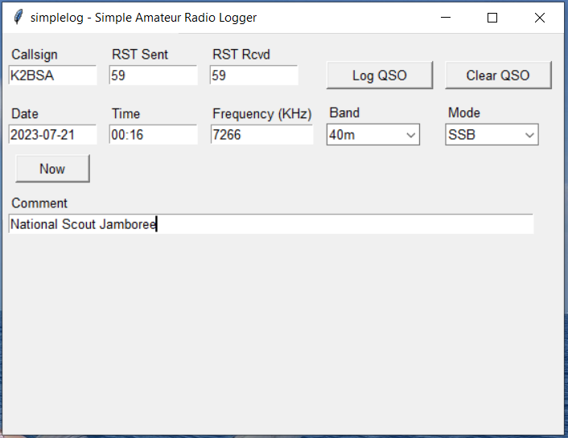
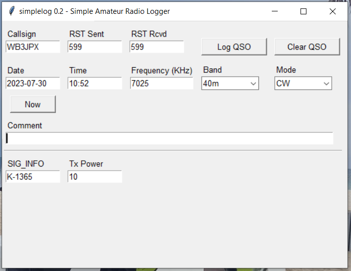

# AB3GY simplelog
Simple amateur radio logging application for Python.  
Captures basic QSO information and appends it directly to an ADIF log file, suitable for uploading to your favorite online logging application, or importing into your favorite logging program.  Designed for casual use and for creating ADIF files from a paper log.  

The default log file is located in the `log` subdirectory.  

Also provides a means to add custom ADIF fields by editing a .INI file. 

Developed for personal use by the author, but available to anyone under the license terms below.  

The main application file is `simplelog.py`  

## Dependencies
Written for Python 3.x.  Uses tkinter for the GUI.  

Requires the `ConfigFile` and `TextFile` modules from ab3gy-pyutils.  
Repository: https://github.com/tkerr/ab3gy-pyutils  

Requires the `adif` module from ab3gy-adif.  
Repository: https://github.com/tkerr/ab3gy-adif  

Copy these files to a local directory and modify the `_env_init.py` file to point to their directory.  

This package has been tested on Windows 10 PCs. Other operating systems have not been tested.  

## Author
Tom Kerr AB3GY  
ab3gy@arrl.net  

## License
Released under the 3-clause BSD license.  
See license.txt for details.  

## Screenshots

### Main window:  

### Main window customized for QRP POTA operation:  

