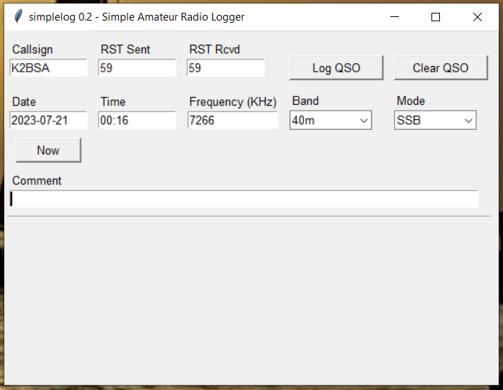

# AB3GY simplelog
Simple amateur radio logging application for Python.

Developed for personal use by the author, but available to anyone under the license terms below.

The main application file is `simplelog.py`

## Dependencies
Written for Python 3.x.  Uses tkinter for the GUI.

This package has been tested on Windows 10 PCs. Other operating systems have not been tested.

## Author
Tom Kerr AB3GY
ab3gy@arrl.net

## License
Released under the 3-clause BSD license.
See license.txt for details.

## Screenshots

### Main window:

